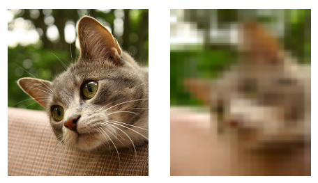

Sketch3 Mosaic Plugin
==================

This is a plugin for Sketch3 to apply mosaic easily

Photo by [Billy Wilson](https://www.flickr.com/photos/billy_wilson/3778943617/)

# Installation

- Download the latest zip file on https://github.com/tomorrowkey/sketch3-mosaic-plugin/releases
- Unzip it
- Open sketch3-mosaic.sketchplugin to install

# Usage

Plugins > Mosaic > Apply mosaic
